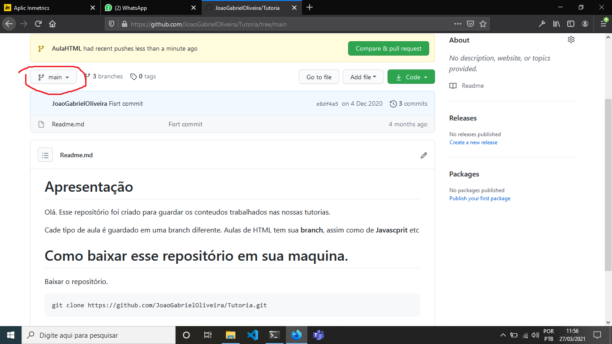
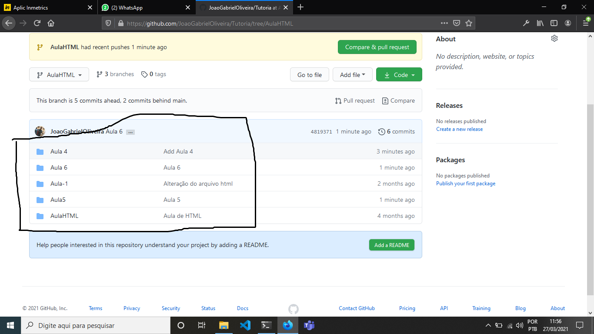

# Apresentação

Olá.
Esse repositório foi criado para guardar os conteudos trabalhados nas nossas tutorias.

Cade tipo de aula é guardado em uma branch diferente. Aulas de HTML tem sua **branch**, assim como de **Javascprit** etc

# Como baixar esse repositório em sua maquina.

Baixar o repositório.
```sh
git clone https://github.com/JoaoGabrielOliveira/Tutoria.git
```

# Como acessar o conteúdo das aulas

Nossas aulas estão divididas em *branchs*, em que cada uma é um assunto diferente.

Para ver o conteúdo das aulas, basta acessar as branchs:

### Passo 1


### Passo 2


### Passo 3
